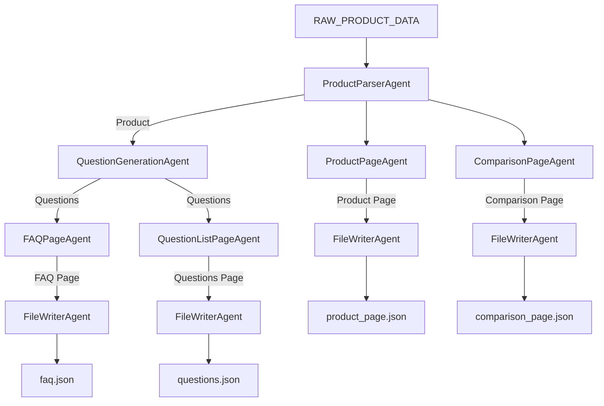

# 🌟 Kasparo Agentic Content Generation System

A modular, multi-agent automation pipeline that transforms a small structured product dataset into fully generated machine-readable JSON content pages.  
This system simulates real-world agentic workflows used in AI-driven content automation engines.

---

# 🚀 Overview

This project ingests a minimal product dataset and autonomously produces:

- **`faq.json`** — A categorized FAQ page  
- **`product_page.json`** — A structured product description page  
- **`comparison_page.json`** — A comparison between the main product and a fictional competitor  
- **(optional)** `questions.json` — All generated user questions  

All content is generated **only from the provided data**, using reusable logic blocks and template rules.  
No external knowledge, scraping, or APIs are used.

---

# 🧠 System Goals

- Build a **modular, agent-based orchestration system**  
- Demonstrate **automation graphs**, **content logic layers**, and **template engines**  
- Produce **clean, deterministic, structured JSON outputs**  
- Show strong engineering design, abstraction, and reasoning  

---

# 🏗️ Architecture Overview

The system follows a **deterministic multi-agent flow**, where each agent has a *single responsibility* and communicates only through structured inputs/outputs.

## 📦 High-Level Pipeline

# 🧩 System Components

## 🟦 1. Models (`models.py`)
Defines the internal data structures:

- **Product**
- **Question**, **FAQItem**
- **ComparisonProduct**
- **Page**

These ensure consistent structure throughout the pipeline.

---

## 🟦 2. Content Logic Blocks (`content_blocks.py`)
Pure transformation functions, each representing a reusable logic component.

### Examples:
- `generate_product_summary_block`
- `generate_usage_block`
- `generate_safety_block`
- `generate_benefits_block`
- `generate_pricing_block`
- `generate_questions` (15+ categorized)

### Comparison Logic:
- `compare_ingredients_block`
- `compare_benefits_block`
- `compare_pricing_block`

These blocks ensure **deterministic, rule-based content generation**.

---

## 🟦 3. Template Engine (`templates.py`)
A lightweight, custom template system that assembles content blocks into structured page JSON.

### Templates Implemented:
- **FAQ Page Template**
- **Product Page Template**
- **Comparison Page Template**

Each template returns a structured **Page** object containing only machine-readable JSON.

---

## 🟦 4. Agents Layer (`agents/`)
Each agent is a standalone unit responsible for exactly one job:

| Agent | Responsibility |
|-------|----------------|
| `ProductParserAgent` | Convert raw dict → Product model |
| `QuestionGenerationAgent` | Create categorized questions |
| `FAQPageAgent` | Build FAQ Page |
| `ProductPageAgent` | Build Product Detail Page |
| `ComparisonPageAgent` | Build Comparison Page with fictional Product B |
| `QuestionListPageAgent` | Produce a JSON list of all generated questions |
| `FileWriterAgent` | Persist Page objects as `.json` files |

Every agent follows **single responsibility principle** and clean **input/output contracts**.

---

## 🟦 5. Orchestrator (`orchestration.py`)
The conductor of the entire pipeline.

### Responsibilities:
- Construct all agents  
- Define the automation graph (DAG)  
- Pass outputs between agents  
- Produce final JSON files into `/output`  

The orchestrator ensures the system runs **deterministically and reproducibly**.

---

# 📂 Folder Structure
Kasparo/
│
├── agents/
│ ├── base.py
│ ├── parser_agent.py
│ ├── question_agent.py
│ ├── faq_page_agent.py
│ ├── product_page_agent.py
│ ├── comparison_page_agent.py
│ ├── question_export_agent.py
│ └── file_writer_agent.py
│
├── content_blocks.py
├── templates.py
├── models.py
├── product_data.py
├── orchestration.py
├── main.py
│
└── output/
├── faq.json
├── product_page.json
├── comparison_page.json
└── questions.json

---

🧭 Design Reasoning & Principles
✔ Single Responsibility Agents

Each agent encapsulates one job, making the system scalable and easy to maintain.

✔ Deterministic Content Logic

No LLM calls, randomness, or external data. All output is synthetic and rule-based.

✔ Modular & Extensible

Adding a new page template or agent is trivial.

✔ Machine-Readable Output

All pages are clean JSON with stable, documented structures.

✔ Real-World Inspired

This mirrors industrial “AI content automation pipelines”
