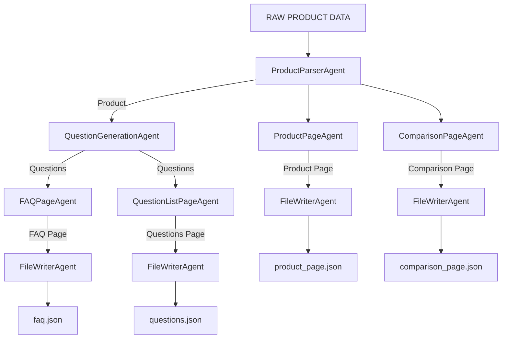

# 📘 Project Documentation — Kasparo Agentic Content Generation System

This document describes the full design, reasoning, and architecture behind the **Kasparo Agentic Content Generation System**, a modular multi-agent pipeline that transforms a small structured product dataset into fully generated JSON content pages.

---

# 🧩 Problem Statement

The goal is to design a **modular, agent-based automation system** capable of:

- Parsing a minimal product dataset  
- Generating 15+ categorized user questions  
- Applying reusable content logic rules  
- Using a custom template engine  
- Producing structured JSON pages:
  - FAQ Page  
  - Product Page  
  - Comparison Page (with fictional Product B)  
- Running through a well-defined multi-agent orchestration graph  
- Ensuring deterministic, machine-readable output  

No external knowledge, APIs, or LLM inference is allowed.  
Only the provided dataset may be used.

---

# 🌅 Solution Overview

The system implements a **multi-agent architecture** where each agent performs one clearly defined task. A reusable set of content logic blocks and a lightweight template engine convert internal models into structured JSON output.

The orchestration layer coordinates all agents into a deterministic workflow, producing three final content pages and an optional question list page.

---

# 📏 Scopes & Assumptions

### **Included**
- Deterministic rule-based content generation  
- Structured JSON output  
- Full agentic pipeline using Python  
- Fictional comparison product generated in controlled constraints  
- Clean, template-driven content assembly  

### **Assumptions**
- Input dataset is always complete and valid  
- No network or external data lookup is required or allowed  
- JSON output format must be stable and predictable  
- Agents do not share hidden states—only explicit inputs/outputs  

---

# 🧠 System Design 

This section explains the complete engineering architecture, core components, design philosophy, and orchestration graph.

---

## 🏗️ High-Level Architecture Diagram



🧩 System Components
🟦 1. Models (models.py)

Defines the internal data structures used throughout the pipeline:

Product

Question, FAQItem

Page

ComparisonProduct

These ensure a consistent, predictable internal representation.

🟦 2. Content Logic Blocks (content_blocks.py)

Reusable, deterministic transformation functions:

Core Blocks

generate_product_summary_block

generate_usage_block

generate_safety_block

generate_benefits_block

generate_pricing_block

generate_questions (guaranteed 15+ categorized)

Comparison Logic Blocks

compare_ingredients_block

compare_benefits_block

compare_pricing_block

All content is rule-based and contains no external knowledge.

🟦 3. Template Engine (templates.py)

A lightweight custom template system assembling logic blocks into JSON page structures.

Templates Implemented:

FAQ Page Template

Product Page Template

Comparison Page Template

Each template outputs a Page object with a clean JSON payload.

🟦 4. Agents Layer (agents/)

Each agent performs one isolated responsibility—this aligns with Single Responsibility Principle (SRP).

Agent	Responsibility
ProductParserAgent	Parse raw input → Product model
QuestionGenerationAgent	Generate categorized questions
FAQPageAgent	Build FAQ Page
ProductPageAgent	Build Product Description Page
ComparisonPageAgent	Build GlowBoost vs fictional Product B Page
QuestionListPageAgent	Optional: export all questions into structured JSON
FileWriterAgent	Write Page payloads to .json files

Agents never share state; communication is strictly via defined inputs/outputs.

🟦 5. Orchestrator (orchestration.py)

The orchestrator coordinates the entire workflow.
It acts as the automation graph controller, defining execution order, data handoff, and final JSON outputs.

Responsibilities:

Instantiating all agents

Running the DAG in the correct sequence

Ensuring deterministic, reproducible execution

Dispatching all final Page objects to the FileWriterAgent

This ensures predictable behavior aligned with real-world agent-based architecture.
```
📂 Folder Structure
Kasparo/
│
├── agents/
│   ├── base.py
│   ├── parser_agent.py
│   ├── question_agent.py
│   ├── faq_page_agent.py
│   ├── product_page_agent.py
│   ├── comparison_page_agent.py
│   ├── question_export_agent.py
│   └── file_writer_agent.py
│
├── content_blocks.py
├── templates.py
├── models.py
├── product_data.py
├── orchestration.py
├── main.py
│
└── output/
    ├── faq.json
    ├── product_page.json
    ├── comparison_page.json
    └── questions.json
```
🧭 Design Reasoning & Principles
✔ Single Responsibility Agents

Every agent does exactly one job—this keeps the system clean and scalable.

✔ Deterministic Logic

All content comes from rule-based functions.
No randomness → reproducible output every run.

✔ Modular & Extensible

Adding new page formats, blocks, or agents is trivial.

✔ Machine-Readable Output

Strict JSON guarantees compatibility with downstream systems.

✔ Industry-Inspired Architecture
